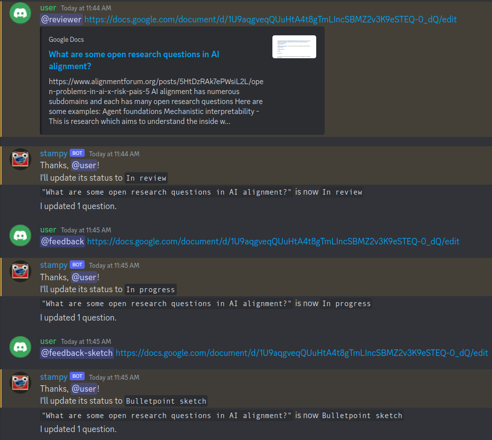
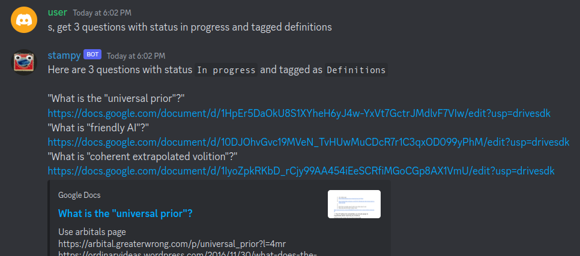
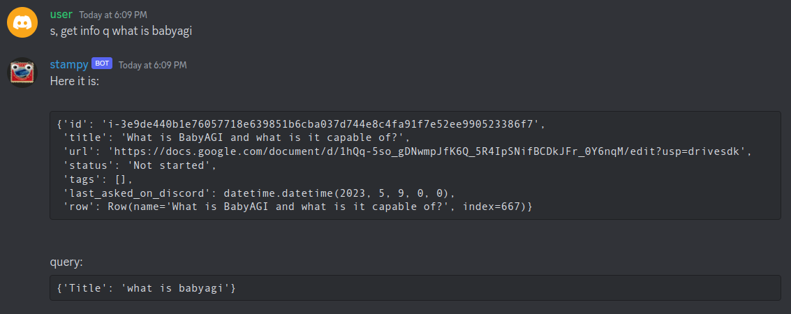

# Stampy commands

This file ~~lists~~ *will list (at some point [WIP])* all available commands for Stampy, divided according to which module handles them.

Whenever you add a new feature to Stampy or meaningfully modify some feature in a way that may alter how it acts, please update this file and test manually whether Stampy's behavior follows the specification.

## QuestionSetter

Changing status (in future perhaps also other attributes) of questions in Coda.

**Permissions:**

- All server members can contribute to AI Safety Questions and [ask for feedback](#review-request).
- Only `@bot dev`s, `@editor`s, and `@reviewer`s can change question status by other commands ([1](#marking-questions-for-deletion-or-as-duplicates) [2](#setting-question-status)).
- Only `@reviewers` can change status of questions to and from  `Live on site` (including [accepting](#review-acceptance) [review requests](#review-request)).

### Review request

On Rob Miles's Discord server, an `@editor` can ask other `@editor`s and `@reviewer`s to give them feedback or review their changes to AI Safety Info questions. You just put one or more links to appropriate GDocs and mention one of: `@reviewer`, `@feedback`, or `@feedback-sketch`. Stampy will spot this and update their statuses in the [coda table with answers](https://coda.io/d/AI-Safety-Info_dfau7sl2hmG/All-Answers_sudPS#_lul8a) appropriately.

- `@reviewer` -> `In review`
- `@feedback` -> `In progress`
- `@feedback-sketch` -> `Bulletpoint sketch`

Some remarks:

- Optimally, review requesting and approval should be mostly confined to the `#editing` forum-channel.
- You don't need to call Stampy explicitly to make him update question status. All that matters is that you include one or more valid links to GDocs with AI Safety Info questions and an appropriate at-mention.

### Review acceptance

A `@reviewer` can **accept** a question by (1) responding to a [review request](#review-request) with a keyword (listed below) or (2) posting one or more valid links to GDocs with AI Safety Info questions with a keyword. Stampy then reacts by changing status to `Live on site`.

The keywords are (case-insensitive):

- accepted
- approved
- lgtm
  - stands for "looks good to me"

### Marking questions for deletion or as duplicates

Use `s, <del/dup>` (or `stampy, <del/dup>`) to change status of questions to `Marked for deletion` or `Duplicate`

### Setting question status

Question status can be changed more flexibly, using the command: `<set/change> <status/to/status to> <status>`, followed by appropriate GDoc links.

Status name is case-insensitive and you can use status aliases.

## Questions

Querying the question database. No special permissions required.

### Counting questions

Stampy can count questions in the database. You can narrow down the counting using a particular status or tag. Use commands like these:

- `s, count questions` - counts all questions
- `s, count questions with status live on site` - counts only questions with status `Live on site`
- `s, count questions tagged decision theory` - counts only questions with the tag `Decision theory`
- `s, count questions with status live on site and tagged decision theory` - counts only questions that **both** have status `Live on site` **and** the tag `Decision theory`

---

Status name is case-insensitive: there is no difference between `Live on site`, `live on site`, or `LIVE ON SITE`. Similarly for tags. You can also use acronym aliases for status (but not for tags), e.g., `los` for `Live on site` or `bs` for `Bulletpoint sketch`.

### Posting questions

You can use Stampy to query the database of questions. Stampy will put links to questions that match your query into the channel.

The general pattern for that command is: `s, <get/post/next> <q/question/questions> <ADDITIONAL_INFO>`.

You can query in three ways

#### 1. Title

Stampy returns first question matching that title

`s, get <q/question/title/titled> <question_title>`

#### 2. Filtering by status on tags

Stampy returns the specified number of questions (max 5, default 1) matching (optional) status and tag

`s, get 3 questions with status in progress and tagged definitions` (like [above](#counting-questions))

If you say, `s, next question`, then Stampy will query all questions, and post the least recently asked one.

#### 3. Last

Stampy will post last question he interacted with.

`s, post last question` / `s, post it`

---

#### Autoposting (Rob Miles' server only)

On Rob Miles' Discord server, Stampy posts a random least recently asked question, if the last question was posted on somebody's request **and** more than 6 hours passed since then. Stampy posts either to the `#editing` channel or the `#general`

### Getting question info

`s, get info <ADDITIONAL_INFO>` (with any filtering option mentioned so far, except `next`) can be used to get detailed information about the question as an entity in the database.

